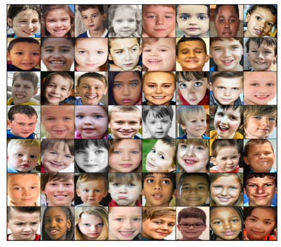
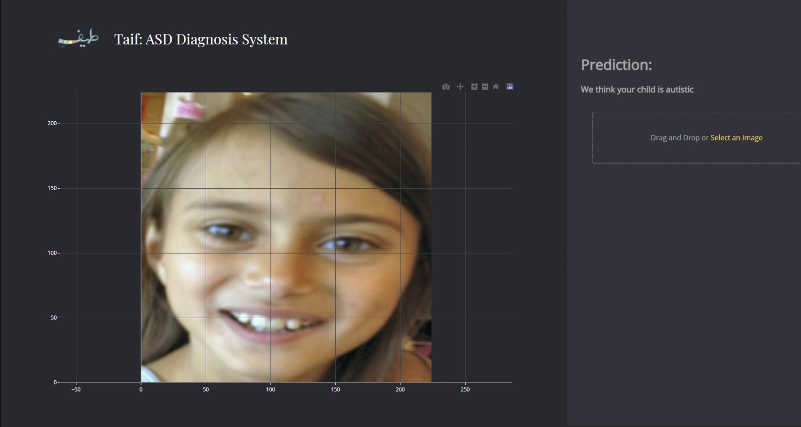
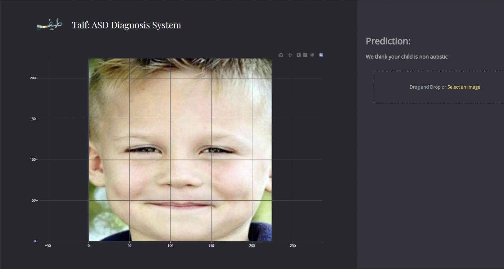

# Project Overview

The main intention behind "Taif" is to identify Autism Spectrum Disorder possible using computer vision technologies, leading to significantly improved outcomes.

# Dataset
We used the ["Detect Autism from a facial image"](https://www.kaggle.com/gpiosenka/autistic-children-data-set-traintestvalidate) dataset from kaggle.  

# Demployment
We used [Dash](https://plotly.com/dash/) library to build a simple web app where users can drag and drop images to view the model's prediction.

Autistic sample:

Non-Autistic sampe:

---
**Follow Taif on twitter**

[@taif_asd11](https://twitter.com/taif_asd11)

---
